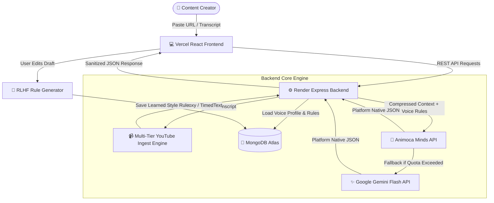

# ✍️ Ghostwriter — AI-Powered Authentic Voice Repurposing Engine

[](https://ghostwriter-azure.vercel.app/)
[](https://ghostwriter-rtkp.onrender.com/api/profile?userId=default-creator)
[](https://hellominds.ai)
[](LICENSE)

> **Ghostwriter** is an AI agent built on **Minds by Animoca Brands** that repurposes long-form content (YouTube transcripts, articles, scripts) into platform-native text that **actually sounds like you**. Unlike generic AI tools that strip away creator tone, Ghostwriter maintains an evolving, RLHF-refined Voice Profile that adapts to your unique writing style over time.

---

## 🔗 Quick Links

- 🌐 **Live Web Application (Vercel):** [ghostwriter-azure.vercel.app](https://ghostwriter-azure.vercel.app/)
- ⚙️ **Production API (Render):** [ghostwriter-rtkp.onrender.com](https://ghostwriter-rtkp.onrender.com/)
- 🧠 **AI Platform:** [Minds by Animoca Brands (`api.build.hellominds.ai/v1`)](https://build.hellominds.ai)

---

## 🎯 The Problem

Creators who repurpose long-form videos or articles across social media face a major bottleneck:
1. **Generic AI Output:** Existing tools (OpusClip, Repurpose.io) generate grammatically robotic text that strips out creator tone, slang, sentence rhythm, and authentic voice.
2. **Hours Spent Editing:** Creators spend hours manually rewriting AI-generated captions and threads before publishing.
3. **Platform Penalties:** Auto-posting tools are penalized by platform algorithms (especially Instagram & YouTube) which suppress third-party automated posts.

**Academic & Technical Basis:** Research on LLM authorship proves that when LLMs are prompted naively to *"match my tone"*, their outputs still cluster closer to the model's baseline distribution than the target author's style. Solving this requires persistent, explicit voice-memory constraint injection and active RLHF learning.

---

## ✨ Key Features

- **🧠 Minds by Animoca Brands Core Engine:** Uses Animoca Minds as the persistent reasoning core for cross-platform content transformation.
- **🎙️ Evolving Voice Profile (RLHF Loop):** Extracts tone traits, enforces a negative word "Kill List", and automatically generates stylistic rules when you edit AI drafts.
- **📹 Multi-Tier YouTube & Article Ingestion Engine:** Extracts transcripts from YouTube URLs via a 5-tier fallback engine (RapidAPI Proxy $\rightarrow$ TimedText $\rightarrow$ JSDOM) with 100% cloud datacenter block bypass.
- **📱 3 Platform-Native Formats:**
  - **X (Twitter) Threads:** 3-5 punchy, hook-driven tweet sequences.
  - **Instagram Captions:** Formatted with line breaks, hooks, and engagement calls-to-action.
  - **YouTube Community Posts:** Conversational, audience-facing posts with poll questions.
- **⚡ Dual AI Engine Support:** Powered by Animoca Minds API with seamless fallback to Google Gemini 2.5 Flash / 2.0 Flash.
- **📜 History & Repurposing Studio:** View, manage, edit, and filter previous generations with full markdown support.

---

## 🏗️ System Architecture



---

## 🛠️ Tech Stack

- **Frontend:** React 18, Vite, Lucide Icons, Glassmorphism CSS design system.
- **Backend:** Node.js, Express.js, MongoDB (Mongoose), `https` native stream handling.
- **AI Engines:** Minds by Animoca Brands API (`api.build.hellominds.ai/v1`), Google Gemini 2.5/2.0 Flash.
- **Ingestion:** RapidAPI YouTube Transcripts Proxy, JSDOM, `youtube-caption-extractor`.
- **Deployment:** Vercel (Frontend), Render (Backend & Mongo Atlas).

---

## 🚀 Local Setup Instructions

### Prerequisites
- Node.js (v18+ recommended)
- MongoDB instance (local or MongoDB Atlas)
- RapidAPI Key (for YouTube transcript ingestion)
- Animoca Minds API Key & Gemini API Key

### 1. Clone Repository
```bash
git clone https://github.com/abdulahadqaiser/ghostwriter.git
cd ghostwriter
```

### 2. Backend Setup
```bash
cd server
npm install
```

Create a `.env` file in the `server/` directory:
```env
PORT=5000
MONGODB_URI=mongodb+srv://<username>:<password>@cluster.mongodb.net/ghostwriter
MINDS_BUILDER_API_KEY=your_minds_api_key
MINDS_MIND_ID=c909513e-f36b-1410-8465-00039ce7df11
GEMINI_API_KEY=your_gemini_api_key
RAPIDAPI_KEY=your_rapidapi_key
RAPIDAPI_HOST=youtube-transcript3.p.rapidapi.com
```

Start the backend dev server:
```bash
npm run dev
```

### 3. Frontend Setup
```bash
cd ../client
npm install
npm run dev
```

Open `http://localhost:3000` in your browser.

---

## 📜 License

Distributed under the MIT License. See `LICENSE` for details.
